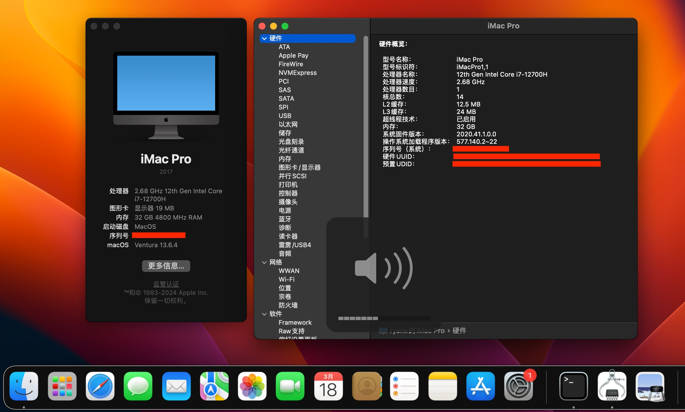
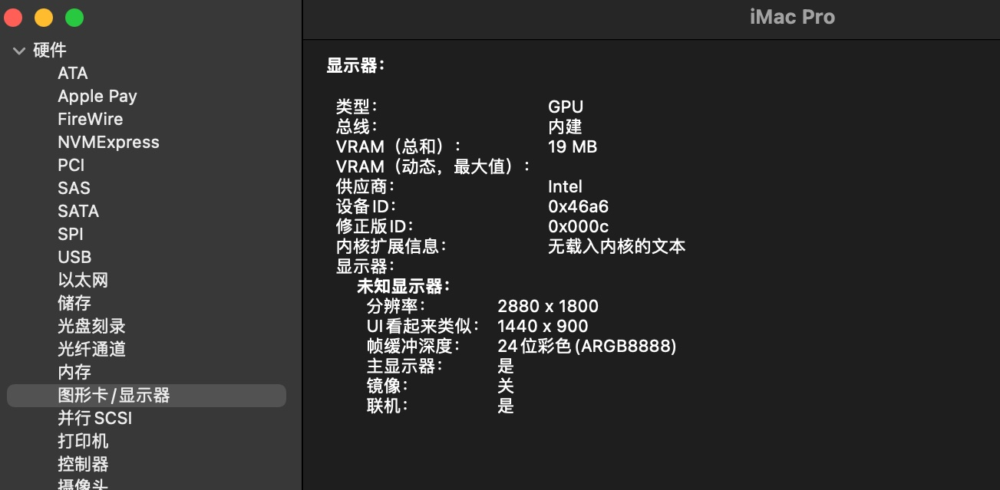
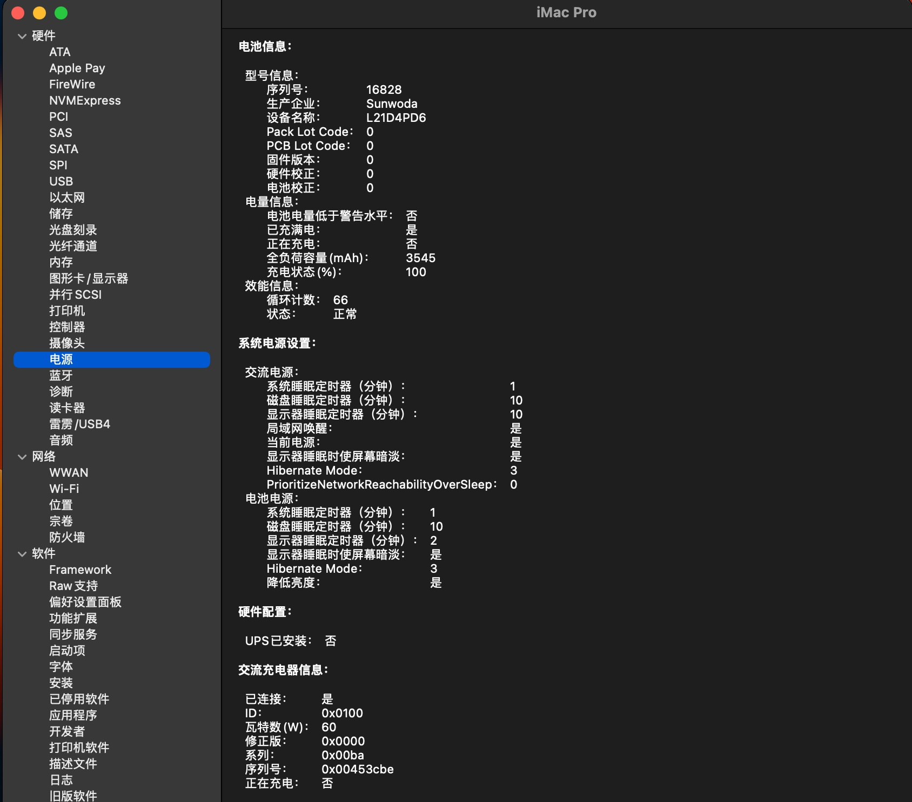
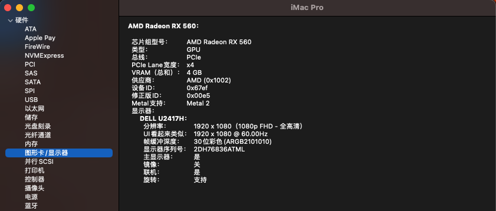
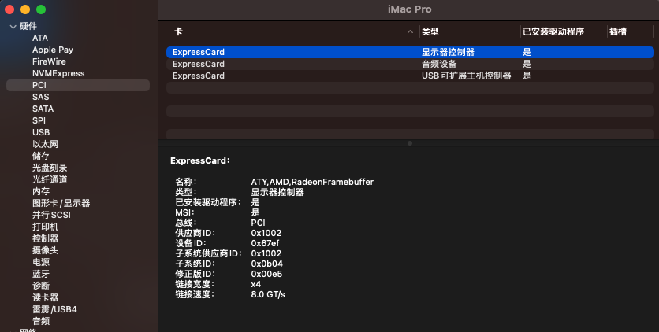

# ThinkBook14+ 2022(AlderLake laptop) hackintosh

### progress: 50%

## screenshot(without eGPU)






## screenshot(with eGPU)




# Details

| OpenCore Version | 0.9.9                |
|------------------|----------------------|
| Bios Version     | HYCN48WW(2024/01/05) |
| macOS Version    | 13.6.4 (Ventura)     |
| SMBios           | iMacPro1,1           |

# Hardware Specifications

| Hardware     | Specification                    | Status        |
|--------------|----------------------------------|---------------|
| CPU          | Intel Core i7-12700H             | ✅ Working     |
| RAM          | LPDDR5 32GB                      | ✅ Working     |
| Audio        | ALC257(layout-id=99)             | ✅ Working     |
| Microphone   | Realtek ALC257                   | 🔶 TODO       |
| WiFi         | Intel AX201                      | ✅ Working     |
| Bluetooth    | AX201                            | ✅ Working     |
| SSD          | SAMSUNG PM9A1 512GB              | ✅ Working     |
| Battery      |                                  | ✅ Working     |
| USB          | -                                | ✅ Working     |
| Keyboard     | -                                | ✅ Working     |
| Trackpad     | ELAN0662 I2C(force-polling mode) | ✅ Working     |
| Webcam       | UVC Camera                       | ✅ Working     |
| MicroSD Card | -                                | 🔶 TODO       |
| iGPU         | Intel Iris Xe Graphics           | ❌ Not Support |
| eGPU         | AMD RX560 4G (on tb3 dock)       | ✅ Working     |
| sleep/wake   | -                                | 🔶 TODO       |
| LVDS         | Brightness Control               | 🔶 TODO       |

# Overview

It is possible to install and run macOS Ventura with eGPU(tb3 or oculink) on alder lake and newer laptops.
without eGPU, the iGPU framebuffer not load, laptop LVDS brightness not work but hidpi ok.
NOTE : eGPU on tb3 do not support device spoof by Whatevergreen

# todo

1. CFG Lock: both modGRUBShell.efi and ru.efi unlock fail: write variable failed 0x00000008  
   0xCA60C VarStoreEFI: VarStoreId: 0x3 [B08F97FF-E6E8-4193-A997-5E9E9B0ADB32], Attrubutes: 7, Size: 379, Name: CpuSetup
   {26 23 03 00 FF 97 8F B0 E8 E6 93 41 A9 97 5E 9E 9B 0A DB 32 07 00 00 00 79 03 43 70 75 53 65 74 75 70 00}
   0xCFC8F One Of: CFG Lock, VarStoreInfo (VarOffset/VarName): 0x43, VarStore: 0x3

2. CPU smc
   temperature sensors show in Intel Power Gadget tool but iStatMenus can't.

# BIOS Settings

* Secure Boot: Disabled
* Everything else defaults.

# Warning!!!

* dont't forgot change PlatformInfo in Config.plist
* do not turn on FileVault!  
  do not turn on FileVault!  
  do not turn on FileVault!

# Post install

* hidpi(200%)   
  terminal ```sudo defaults write /Library/Preferences/com.apple.windowserver.plist DisplayResolutionEnabled -bool true```
* Reduce Motion & Reduce Transparency  
  Settings > Accessibility > Display 
